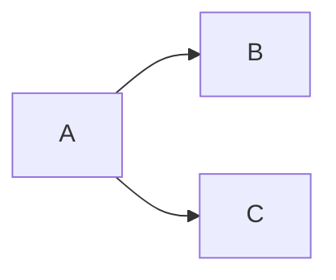

# Divar Post API
A sample gRPC server with Go inspired by Divar's postview microservice.
This project aims to share best practices and design patterns for writing a new go microservice with a good quality that meets our requirements inside CafeBazaar.  

You have find a better pattern or library? Let us know by creating a new issue.

## How to run:
Compile the code
```
make postviewd
```
Then Run the binary
```
./postviewd serve
```

# Emergency
In case of emergencies checkout our [Emergency ABC](EMERGENCY.md).

# How does it work?
`Use this section in order to explain how your system works`

# Development
If you want to contribute to this code, please read `CONTRIBUTING.md` first.

# Dependency Graph

