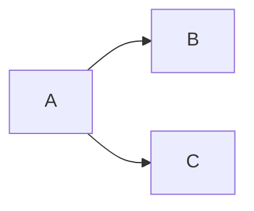

# Divar Post API
`Describe your project's mission here.`

## How to run:
`Describe how to build and run`

# Emergency
In case of emergencies checkout our [Emergency ABC](EMERGENCY.md).

# How does it work?
`Use this section in order to explain how your system works`

# Development
If you want to contribute to this code, please read `CONTRIBUTING.md` first.

# Dependency Graph

